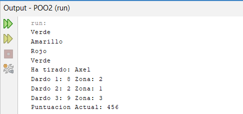

# Tecnologia-en-desarrollo-de-Software---POO
Repositorio en Github para trabajos, ejercicios, practicas sobre la materia "Programación Orientada a Objetos" en Java.

## 📂 Índice

### Clases y Objetos
- [Test](POO/Clases-y-Objetos/Test.java) - Archivo central en donde se ejecutara todo.
  

  
Ver solución del Ejercicio 1

  

  
- [Dardos](./POO/Clases-y-Objetos/Dardos.java) - Ejercicio de Nivel Inicial 7.a.5.
  

  
Ver solución del Ejercicio 1

- [Dardos](POO/Clases-y-Objetos/Dardos.java) - Ejercicio de Nivel Medio 7.b.1.
  

  
Ver solución del Ejercicio 1

