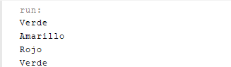
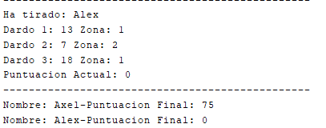

# Tecnologia-en-desarrollo-de-Software---POO
Repositorio en Github para trabajos, ejercicios, practicas sobre la materia "Programación Orientada a Objetos" en Java.

## 📂 Índice

### Clases y Objetos
- [Test](POO/Clases-y-Objetos/Test.java) - Archivo central en donde se ejecutara todo.
  

  
Imagen de lo Mostrado en Consola

  

  
- [Semaforo](./POO/Clases-y-Objetos/Semaforo.java) - Ejercicio de Nivel Inicial 7.a.5.

  
Imagen de lo Mostrado en Consola

  

- [Dardos](POO/Clases-y-Objetos/Dardos.java) - Ejercicio de Nivel Medio 7.b.1.

 

  
Imagen de lo Mostrado en Consola

  

### Practicas
Practicas aleatorias de temas aleatorios

- [Condiciones](POO/Practicas/CondicionesTest1.java) - Practica de condiciones basicas.
- [Pruebas-Basicas](POO/Practicas/CondicionesTest1.java) - Practica de pruebas basicas.

### Tareas
- [Pruebas-de-Evaluacion](POO/Tareas/EV_Prueba.java) - Practica preliminar del primer parcial.
- [Taller](POO/Tareas/Taller.java) - Taller de Arrays con notas de Alumnos.
